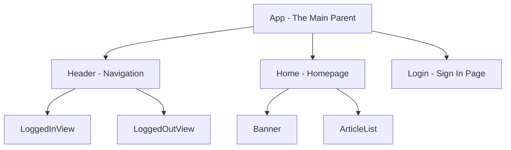
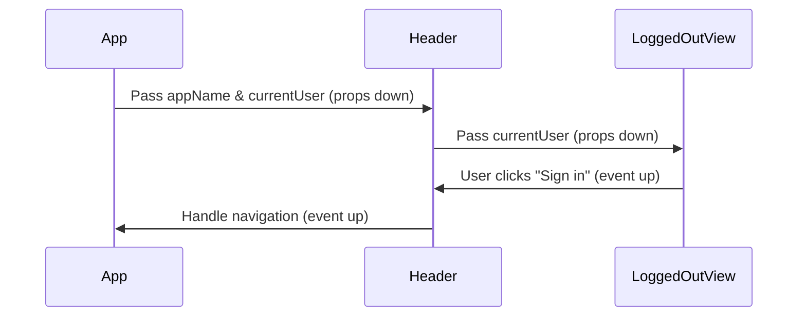
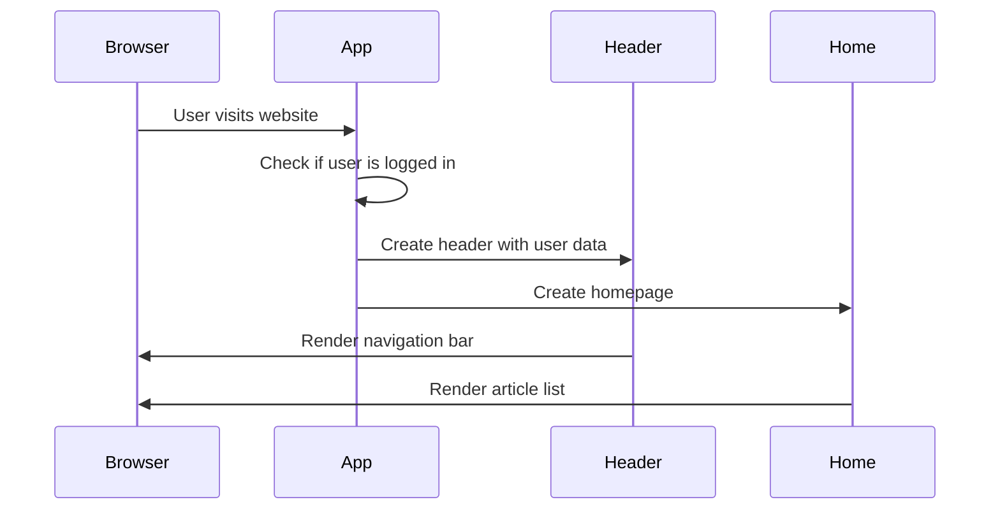

# Chapter 1: Component Architecture

Imagine you're building a house with LEGO blocks. Instead of creating one massive, unchangeable structure, you build small, reusable pieces that can snap together in different ways. Some pieces are simple (like a single brick), while others are complex (like a pre-built window or door). This is exactly how React components work in our blogging application!

## The Problem: Building Complex UIs Without Getting Lost

Let's say you want to build a blogging website like Medium. You need a navigation bar, article lists, user profiles, login forms, and much more. If you tried to write all of this in one giant file, you'd quickly get overwhelmed and lost. Plus, what if you want to use the same navigation bar on multiple pages? You'd have to copy and paste code everywhere!

Component architecture solves this by breaking your user interface into small, manageable, reusable pieces.

## What Are Components?

Think of components as smart LEGO blocks for building websites. Each component:
- Has a specific job (like showing a button or displaying an article)
- Can be reused anywhere in your app
- Can contain other smaller components
- Can be either "smart" (connected to data) or "simple" (just for display)

Let's look at a simple component from our app:

```javascript
const LoggedOutView = props => {
  if (!props.currentUser) {
    return (
      <ul className="nav navbar-nav pull-xs-right">
        <li className="nav-item">
          <Link to="/" className="nav-link">Home</Link>
        </li>
        <li className="nav-item">
          <Link to="/login" className="nav-link">Sign in</Link>
        </li>
      </ul>
    );
  }
  return null;
};
```

This component has one job: show navigation links for users who aren't logged in. It's simple, focused, and reusable.

## The Component Hierarchy: Like a Family Tree

Components are organized in a hierarchy, just like a family tree. At the top, you have a parent component that contains and coordinates child components.



The `App` component is like the foundation of your house - everything else is built on top of it.

## Two Types of Components: Smart and Simple

### Simple Components (Display Only)
These components just show what they're told to show, like a picture frame that displays whatever photo you put in it:

```javascript
const Header = (props) => {
  return (
    <nav className="navbar">
      <Link to="/" className="navbar-brand">
        {props.appName}
      </Link>
      <LoggedOutView currentUser={props.currentUser} />
    </nav>
  );
};
```

The `Header` component receives data through `props` (properties) and displays it. It doesn't know where the data comes from - it just shows it.

### Smart Components (Connected to Data)
These components are connected to the app's shared data storage (which we'll learn about in [Redux State Management System](02_redux_state_management_system_.md)). They're like smart home devices that can access and control the house's central systems:

```javascript
const mapStateToProps = state => ({
  appName: state.common.appName,
  currentUser: state.common.currentUser
});

export default connect(mapStateToProps)(App);
```

The `connect` function makes a component "smart" by giving it access to shared data.

## How Components Communicate: The Data Flow

Components communicate through a pattern called "props down, events up":



1. **Props Down**: Parent components pass data to children through props
2. **Events Up**: Child components notify parents when something happens (like a button click)

## Building Our Login Page: A Complete Example

Let's see how components work together to build a login page:

```javascript
class Login extends React.Component {
  render() {
    return (
      <div className="auth-page">
        <h1>Sign In</h1>
        <ListErrors errors={this.props.errors} />
        <form onSubmit={this.submitForm}>
          {/* Form fields here */}
        </form>
      </div>
    );
  }
}
```

This `Login` component:
1. Displays a title and form
2. Uses a `ListErrors` component to show any error messages
3. Handles form submission when the user clicks "Sign in"

The `ListErrors` component is reused across multiple pages (login, register, settings) - that's the power of component reusability!

## What Happens When You Load the App

Here's the step-by-step process when someone visits your blogging site:



1. The browser loads your app and creates the `App` component
2. `App` checks if there's a logged-in user
3. `App` creates child components (`Header`, `Home`, etc.) and passes them data
4. Each child component renders its part of the page
5. The complete page appears in the browser

## Under the Hood: How Components Actually Work

When you write `<Header appName="MyBlog" />`, React:

1. **Creates a component instance**: Like making a new LEGO structure from the blueprint
2. **Passes props**: Gives the component the data it needs (`appName="MyBlog"`)
3. **Calls render()**: Asks the component to describe what it should look like
4. **Updates the DOM**: Changes the actual webpage to match the component's description

The magic happens in the `render()` method - it's like a recipe that describes how to build the component:

```javascript
render() {
  return (
    <div>
      <h1>{this.props.appName}</h1>
      <p>Welcome to our blog!</p>
    </div>
  );
}
```

## Putting It All Together

Component architecture gives us:
- **Reusability**: Write once, use everywhere (like the `Header` component)
- **Organization**: Each component has a clear, focused job
- **Maintainability**: Easy to find and fix bugs when everything is organized
- **Teamwork**: Different developers can work on different components

Think of it like organizing a kitchen: instead of having one giant drawer with everything mixed together, you have separate drawers for utensils, plates, and tools. Each component is like a specialized drawer that makes cooking (or coding) much more efficient!

## Conclusion

You've just learned the foundation of how React applications are built! Component architecture breaks down complex user interfaces into manageable, reusable pieces that work together like a well-orchestrated team. Each component has a specific role, and they communicate through a simple pattern of passing data down and events up.

Now that you understand how components are organized and work together, you're ready to learn about how they share and manage data across your entire application. In the next chapter, we'll explore [Redux State Management System](02_redux_state_management_system_.md), which acts like a central command center for all your app's data.

