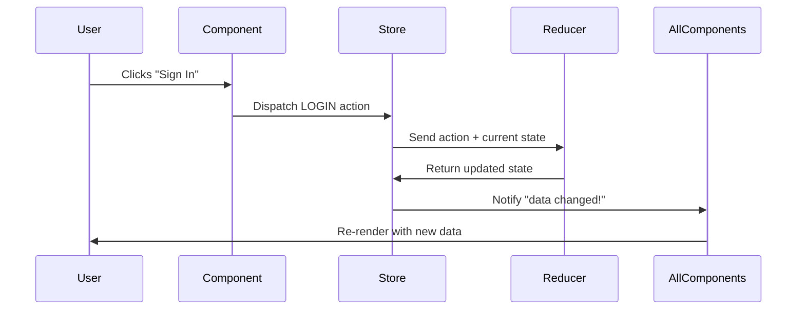

# Chapter 2: Redux State Management System

Now that you understand how components work together like LEGO blocks from [Component Architecture](01_component_architecture_.md), you might be wondering: "How do all these components share and manage data?" Imagine if every LEGO block had to remember everything about the entire house you're building - it would be chaos! This is where Redux comes to the rescue.

## The Problem: Sharing Data Between Components Gets Messy

Let's say you're building our blogging app and you need to show the current user's name in three different places:
1. The navigation bar (to show "Welcome, John!")
2. The article editor (to show "Publishing as John")
3. The settings page (to show "John's Settings")

Without Redux, you'd have to pass the user's data down through multiple layers of components, even if some components don't need it. It's like having to tell every person in a telephone chain the same message - exhausting and error-prone!

Even worse, what happens when the user logs out? You'd have to update the user information in all three places, and they might get out of sync. One component might still show "Welcome, John!" while another shows "Please log in."

## What is Redux? Your App's Central Filing Cabinet

Redux solves this by creating a single, central place to store ALL your app's data - think of it as a well-organized office filing cabinet that everyone in the company uses.

Here's how the filing cabinet analogy works:

- **The Store** (filing cabinet): Holds all your app's data in one place
- **Actions** (standardized forms): When someone wants to change something, they fill out a specific form
- **Reducers** (filing clerk): The person who knows exactly how to update the files when they receive a form
- **Middleware** (security guards): Can intercept and process forms before they reach the filing clerk

## The Four Key Players in Redux

### 1. The Store: Your App's Memory Center

The store is like a giant JavaScript object that holds all your app's data:

```javascript
// What your app's data might look like
{
  currentUser: { name: "John", email: "john@example.com" },
  articles: [{ title: "My First Post", author: "John" }],
  isLoading: false
}
```

There's only ONE store for your entire app. Every component can read from it, but no one can change it directly.

### 2. Actions: Standardized Request Forms

When something needs to change, you create an action - a simple object that describes what happened:

```javascript
// Action: "Someone wants to log in"
{
  type: 'LOGIN',
  payload: { user: { name: "John", email: "john@example.com" } }
}
```

Actions are like filling out a standardized form: "I want to LOGIN, and here's the user information."

### 3. Reducers: The Filing Clerk Who Updates Everything

A reducer is a function that receives the current data and an action, then returns the updated data:

```javascript
function authReducer(currentState = {}, action) {
  if (action.type === 'LOGIN') {
    return {
      ...currentState,
      currentUser: action.payload.user,
      isLoggedIn: true
    };
  }
  return currentState; // No changes needed
}
```

The reducer is like a filing clerk who knows exactly where to file each document and how to update the records.

### 4. Middleware: The Security Guards

Middleware sits between actions and reducers, like security guards who can inspect and process requests:

```javascript
// Middleware that logs every action
const loggingMiddleware = store => next => action => {
  console.log('Action happening:', action.type);
  next(action); // Pass it along to the reducer
};
```

## Solving Our User Data Problem with Redux

Let's see how Redux solves our original problem of showing user data in multiple components.

### Step 1: Create the Store

First, we set up our central filing cabinet:

```javascript
import { createStore } from 'redux';
import reducer from './reducer';

const store = createStore(reducer);
```

This creates our store using all the reducer functions that know how to handle different types of data.

### Step 2: Connect Components to the Store

Instead of passing user data down through props, we connect components directly to the store:

```javascript
// Connect the Header component to get user data
const mapStateToProps = state => ({
  currentUser: state.common.currentUser,
  appName: state.common.appName
});

export default connect(mapStateToProps)(Header);
```

Now the Header component can directly access user data from the store, no matter how deeply nested it is!

### Step 3: Dispatch Actions to Update Data

When a user logs in, we dispatch an action:

```javascript
// When login form is submitted
store.dispatch({
  type: 'LOGIN',
  payload: { user: userData }
});
```

This action goes to all the reducers, and the auth reducer updates the user information.

### Step 4: All Connected Components Update Automatically

Here's the magic: when the store updates, ALL connected components automatically re-render with the new data. The navigation bar, editor, and settings page all update instantly!

## Under the Hood: The Redux Data Flow

Let's trace what happens when a user clicks the "Sign In" button:



1. **User clicks "Sign In"**: The login component captures this event
2. **Dispatch action**: Component sends a LOGIN action to the store
3. **Reducer processes**: The auth reducer receives the action and current state, then returns updated state
4. **Store updates**: The store replaces its old state with the new state from the reducer
5. **Components re-render**: All connected components automatically update with the new user data

## Diving Deeper: How Our App Uses Redux

Let's look at how our blogging app implements this system:

### Action Types: The List of Possible Forms

We define all possible actions in one place:

```javascript
// From src/constants/actionTypes.js
export const LOGIN = 'LOGIN';
export const LOGOUT = 'LOGOUT';
export const HOME_PAGE_LOADED = 'HOME_PAGE_LOADED';
```

This is like having a catalog of all the different forms people can fill out.

### Multiple Reducers: Specialized Filing Clerks

Our app splits data management into specialized reducers:

```javascript
// From src/reducer.js - combining different reducers
export default combineReducers({
  auth,      // Handles login/logout
  article,   // Handles article data
  common,    // Handles app-wide data
  home       // Handles homepage data
});
```

Each reducer is like a specialized filing clerk who only handles certain types of documents.

### The Common Reducer: Handling App-Wide Data

Let's look at how the common reducer handles login:

```javascript
// From src/reducers/common.js
export default (state = defaultState, action) => {
  switch (action.type) {
    case LOGIN:
    case REGISTER:
      return {
        ...state,
        currentUser: action.error ? null : action.payload.user,
        token: action.error ? null : action.payload.user.token
      };
    case LOGOUT:
      return { 
        ...state, 
        currentUser: null, 
        token: null 
      };
    default:
      return state;
  }
};
```

When a LOGIN action arrives, this reducer updates the current user and authentication token. If there was an error, it sets them to null.

### Middleware: Adding Superpowers

Our app uses middleware to handle complex operations:

```javascript
// From src/middleware.js - handling API calls
const promiseMiddleware = store => next => action => {
  if (isPromise(action.payload)) {
    // This action contains an API call!
    action.payload.then(result => {
      action.payload = result;
      store.dispatch(action); // Send the completed action
    });
    return;
  }
  next(action); // Regular action, pass it through
};
```

This middleware is like a security guard who says: "If this form includes an API request, I'll handle that and come back when it's done."

## Creating the Store: Putting It All Together

Finally, we create our store with all the pieces:

```javascript
// From src/store.js
export const store = createStore(
  reducer, 
  composeWithDevTools(getMiddleware())
);
```

This creates our central filing cabinet with:
- All the reducers (filing clerks) ready to handle different types of data
- Middleware (security guards) to handle special cases like API calls
- Development tools to help us debug

## Redux in Action: A Real Example

Let's trace through what happens when a user loads the homepage:

1. **Component mounts**: The Home component loads and needs article data
2. **Dispatch action**: It dispatches `HOME_PAGE_LOADED` with article data from the API
3. **Middleware processes**: The promise middleware sees this is an API call and waits for it to complete
4. **Reducer updates**: The home reducer receives the articles and updates the store
5. **Components re-render**: The Home component automatically displays the new articles

All of this happens automatically - the component just says "I need homepage data" and Redux handles the rest!

## Why Redux Makes Everything Better

Redux gives us four superpowers:

1. **Predictability**: Data changes only happen through actions and reducers
2. **Centralization**: All app data lives in one place
3. **Debugging**: You can see exactly what actions caused what changes
4. **Time Travel**: You can replay actions to debug problems (with Redux DevTools)

Think of it like having a perfectly organized library instead of books scattered everywhere. You always know where to find what you need, and there's a clear system for adding new books.

## Conclusion

You've just learned how Redux acts as your app's central command center! Instead of components awkwardly passing data around like a game of telephone, Redux provides a clean, predictable way to manage all your app's data in one place.

The key insight is the unidirectional data flow: components dispatch actions, reducers update the store, and components automatically re-render. It's like having a well-organized office where everyone follows the same procedures for requesting and updating information.

Now that you understand how components share data through Redux, you're ready to learn how your app communicates with the outside world. In the next chapter, we'll explore [API Agent](03_api_agent_.md), which handles all the behind-the-scenes communication with servers to fetch and save data.

