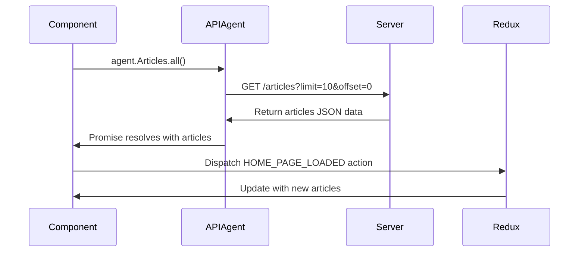
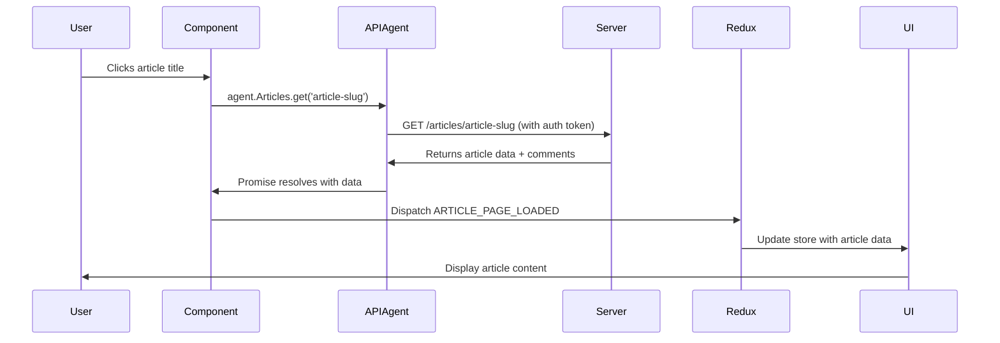

# Chapter 3: API Agent

Now that you understand how components share data through Redux from [Redux State Management System](02_redux_state_management_system_.md), you might be wondering: "But where does all this data actually come from?" Your app's components and Redux store work perfectly together, but they need to communicate with a backend server to get articles, user information, and save new content. This is where the API Agent comes to the rescue!

## The Problem: Talking to Servers is Complicated

Imagine you're building our blogging app and you need to:
- Fetch a list of articles when users visit the homepage
- Save a new article when someone clicks "Publish"
- Log in users and remember their authentication
- Load user profile information

Without an organized system, every component would need to know:
- The exact server URL for each type of data
- How to format requests properly
- How to include authentication tokens
- How to handle errors and loading states

It would be like every employee in a company trying to negotiate their own international business deals - chaotic and inconsistent!

## What is an API Agent? Your App's Diplomatic Ambassador

The API Agent acts like a professional diplomat who handles all communication between your frontend app and the backend server. Just like a diplomatic envoy who knows all the protocols, languages, and customs needed to work with foreign governments, the API Agent knows:

- **Where to find everything**: All the server endpoints and URLs
- **How to speak the language**: Proper request formatting and authentication
- **What credentials to present**: Managing authentication tokens
- **How to handle responses**: Processing successful data and error cases

Think of it as having one specialized department that handles all international relations, so the rest of your company can focus on their core work.

## The API Agent in Action: A Simple Example

Let's say a user wants to read an article titled "Learning React". Here's what happens:

```javascript
// Instead of every component doing this messy work:
fetch('https://conduit.productionready.io/api/articles/learning-react', {
  headers: { 'Authorization': 'Token abc123...' }
})
.then(response => response.json())
.then(data => /* handle the article data */)

// Your component simply does this:
agent.Articles.get('learning-react')
```

The component just says "I want the 'learning-react' article" and the API Agent handles all the complex communication details!

## Breaking Down the API Agent: Four Key Responsibilities

### 1. The Communication Layer: Making HTTP Requests

At its core, the API Agent uses a library called `superagent` to make HTTP requests:

```javascript
import superagentPromise from 'superagent-promise';
import _superagent from 'superagent';

const superagent = superagentPromise(_superagent, global.Promise);
const API_ROOT = 'https://conduit.productionready.io/api';
```

This sets up the basic communication tools and tells our agent where the server lives. It's like setting up a phone and knowing the main office number.

### 2. The Security Guard: Handling Authentication

The API Agent manages authentication tokens automatically:

```javascript
let token = null;
const tokenPlugin = req => {
  if (token) {
    req.set('authorization', `Token ${token}`);
  }
}
```

When a user logs in, we give the agent their security badge (token). From then on, every request automatically includes this badge so the server knows who's asking for what.

### 3. The Request Factory: Standardized HTTP Methods

The agent provides four standard ways to communicate:

```javascript
const requests = {
  get: url => superagent.get(`${API_ROOT}${url}`).use(tokenPlugin),
  post: (url, body) => superagent.post(`${API_ROOT}${url}`, body).use(tokenPlugin),
  put: (url, body) => superagent.put(`${API_ROOT}${url}`, body).use(tokenPlugin),
  del: url => superagent.del(`${API_ROOT}${url}`).use(tokenPlugin)
};
```

These are like four different types of standardized forms:
- **GET**: "Please give me some information"
- **POST**: "Here's new information to save"
- **PUT**: "Please update this existing information"
- **DELETE**: "Please remove this information"

### 4. The Resource Managers: Organized by Data Type

Instead of having one giant mess of functions, the API Agent organizes methods by the type of data they handle:

```javascript
const Articles = {
  all: page => requests.get(`/articles?limit=10&offset=${page * 10}`),
  get: slug => requests.get(`/articles/${slug}`),
  create: article => requests.post('/articles', { article }),
  favorite: slug => requests.post(`/articles/${slug}/favorite`)
};
```

This creates specialized departments: Articles, Auth (authentication), Comments, and Profiles. Each department knows exactly how to handle their specific type of data.

## Solving Our Use Case: Loading the Homepage

Let's trace through what happens when a user visits our blog's homepage and wants to see a list of articles:

### Step 1: Component Requests Data

The Home component needs articles, so it asks the API Agent:

```javascript
// In the Home component
componentDidMount() {
  this.props.onLoad(agent.Articles.all());
}
```

The component simply says "I need all articles" and doesn't worry about how to get them.

### Step 2: API Agent Makes the Request

Here's what happens inside `agent.Articles.all()`:

```javascript
all: page => requests.get(`/articles?limit=10&offset=${page * 10}`)
```

The API Agent:
1. Takes the page number (defaulting to 0 for the first page)
2. Builds the proper URL with pagination parameters
3. Uses the `requests.get()` method to fetch the data
4. Automatically includes authentication if the user is logged in

### Step 3: Server Communication Flow

Let's see the complete communication process:



1. **Component requests**: "I need all articles"
2. **Agent translates**: Converts this to a proper HTTP GET request
3. **Server responds**: Returns JSON data with article list
4. **Agent delivers**: Passes the clean data back to the component
5. **Redux updates**: Component dispatches action to update the store
6. **UI refreshes**: All connected components automatically show new articles

## Under the Hood: How Authentication Works

One of the API Agent's most important jobs is managing user authentication. Let's see how this works:

### Setting the Token

When a user logs in successfully, we tell the API Agent to remember their credentials:

```javascript
// After successful login
agent.setToken(user.token);
```

This stores the authentication token in a private variable that gets attached to every future request.

### Automatic Token Attachment

Every request automatically includes the user's authentication:

```javascript
const tokenPlugin = req => {
  if (token) {
    req.set('authorization', `Token ${token}`);
  }
}
```

This plugin acts like a security guard who automatically shows your ID badge every time you enter a building. You don't have to remember to do it - it happens automatically.

### Logout Cleanup

When a user logs out, we clear their credentials:

```javascript
// When user logs out
agent.setToken(null);
```

Now all future requests will be made as an anonymous user.

## Diving Deeper: The Resource Organizations

Let's explore how each resource manager handles different types of data:

### Articles: The Content Department

The Articles manager handles everything related to blog posts:

```javascript
const Articles = {
  all: page => requests.get(`/articles?limit=10&offset=${page * 10}`),
  byAuthor: (author, page) => requests.get(`/articles?author=${author}`),
  get: slug => requests.get(`/articles/${slug}`),
  create: article => requests.post('/articles', { article }),
  favorite: slug => requests.post(`/articles/${slug}/favorite`)
};
```

Each method has a specific job:
- `all()`: Get a paginated list of all articles
- `byAuthor()`: Get articles written by a specific author
- `get()`: Get one specific article by its slug (URL-friendly title)
- `create()`: Save a new article
- `favorite()`: Mark an article as favorited

### Auth: The Security Department

The Auth manager handles user authentication:

```javascript
const Auth = {
  login: (email, password) => 
    requests.post('/users/login', { user: { email, password } }),
  register: (username, email, password) => 
    requests.post('/users', { user: { username, email, password } }),
  current: () => requests.get('/user')
};
```

- `login()`: Verify user credentials and get authentication token
- `register()`: Create a new user account
- `current()`: Get the current logged-in user's information

### Comments: The Discussion Department

The Comments manager handles article discussions:

```javascript
const Comments = {
  forArticle: slug => requests.get(`/articles/${slug}/comments`),
  create: (slug, comment) => 
    requests.post(`/articles/${slug}/comments`, { comment }),
  delete: (slug, commentId) => 
    requests.del(`/articles/${slug}/comments/${commentId}`)
};
```

Each comment is tied to a specific article (identified by its slug), and users can create or delete comments.

## Error Handling: When Things Go Wrong

The API Agent also handles errors gracefully. When a request fails, it returns a promise that rejects with error information:

```javascript
agent.Articles.get('nonexistent-article')
  .then(article => {
    // Success: display the article
  })
  .catch(error => {
    // Error: show "Article not found" message
  });
```

This allows components to handle success and error cases appropriately without needing to know the details of HTTP status codes or server error formats.

## The Complete Data Flow: From Click to Display

Let's trace through a complete example of what happens when a user clicks on an article title:



1. **User interaction**: User clicks on "How to Learn React"
2. **Component handling**: Article component calls `agent.Articles.get('how-to-learn-react')`
3. **Agent processing**: API Agent builds proper request with authentication
4. **Server communication**: Makes HTTP GET request to `/articles/how-to-learn-react`
5. **Data return**: Server sends back article content, author info, and metadata
6. **Redux update**: Component dispatches action with the article data
7. **UI refresh**: Article page displays with the fetched content

## Why the API Agent Makes Everything Better

The API Agent provides four major benefits:

1. **Centralization**: All server communication happens in one place
2. **Consistency**: Every request follows the same patterns and includes proper authentication
3. **Maintainability**: If the server API changes, you only update the agent, not every component
4. **Debugging**: Easy to see all network requests and responses in one place

Think of it like having a professional translator who handles all international business communications. Your team can focus on building great features while the translator ensures all messages are properly formatted, authenticated, and delivered.

## Real-World Usage in Components

Here's how components actually use the API Agent in practice:

```javascript
// In a Login component
handleSubmit = () => {
  const promise = agent.Auth.login(this.state.email, this.state.password);
  this.props.onSubmit(promise);
};

// In an Article component
componentDidMount() {
  const promise = agent.Articles.get(this.props.match.params.slug);
  this.props.onLoad(promise);
}
```

Components stay clean and focused on user interface logic, while the API Agent handles all the messy details of server communication.

## Conclusion

You've just learned how the API Agent acts as your app's diplomatic ambassador to the backend server! Instead of every component needing to know the complex details of HTTP requests, authentication, and server URLs, the API Agent provides a clean, organized interface for all server communication.

The key insight is centralization and abstraction: by putting all API communication in one place and organizing it by resource type (Articles, Auth, Comments, etc.), your app becomes much easier to maintain and debug. Components can simply say "I need this data" and trust that the API Agent will handle all the technical details.

Think of it like having a professional customer service department - your internal teams can focus on their core work while the customer service team handles all external communications using proper protocols and procedures.

Now you understand the complete data flow in a React-Redux application: components display UI and handle user interactions, Redux manages shared state, and the API Agent handles all server communication. These three systems work together to create a smooth, maintainable application architecture where each part has a clear, focused responsibility!

