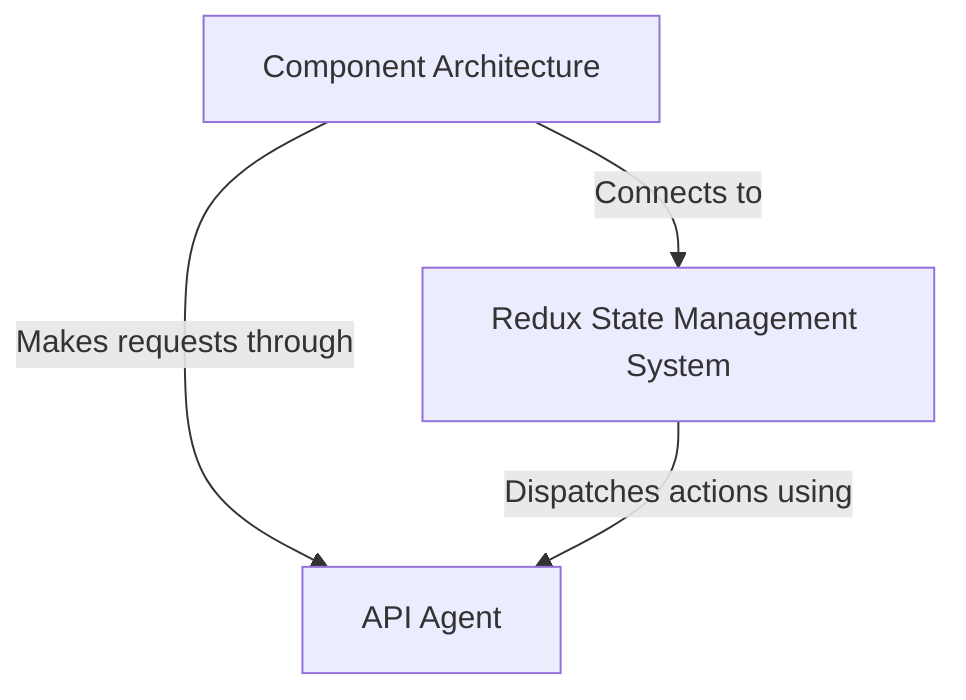

# Tutorial: react-redux-realworld-example-app

This is a **React-Redux web application** that implements a blogging platform called *Conduit*. 
Users can **create accounts**, **write and edit articles**, **follow other users**, and **comment on posts**. 
The app uses *Redux* for **centralized state management** to keep all data organized and synchronized across components, 
while an *API Agent* handles all **communication with the backend server** to fetch and save data like articles, user profiles, and comments.

**Source Repository:** [https://github.com/SCpradhan/react-redux-realworld-example-app](https://github.com/SCpradhan/react-redux-realworld-example-app)

## Chapters

1. [Component Architecture
](01_component_architecture_.md)
2. [Redux State Management System
](02_redux_state_management_system_.md)
3. [API Agent
](03_api_agent_.md)
